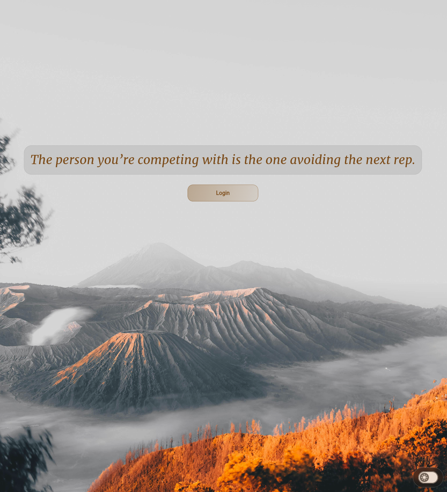
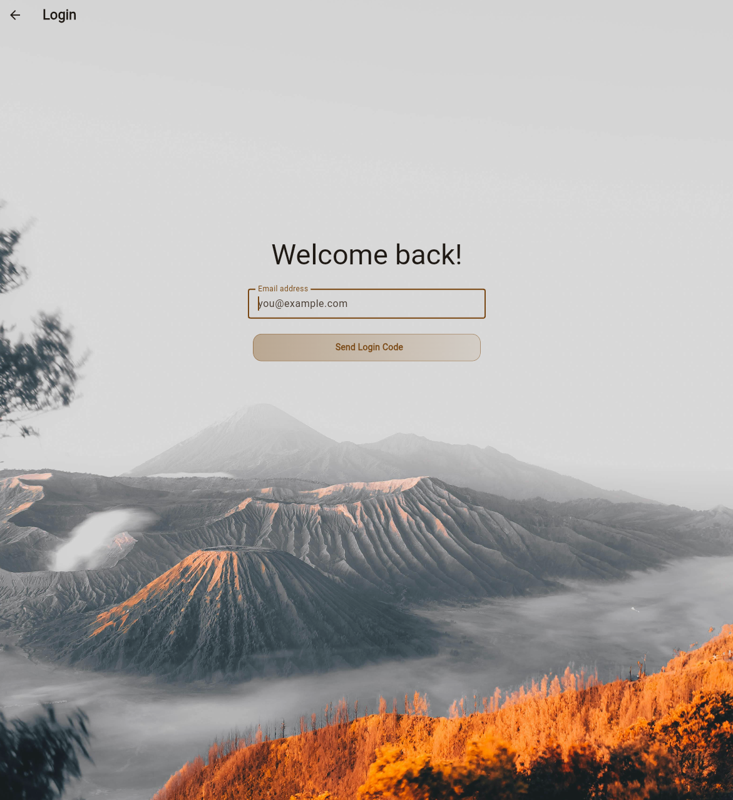
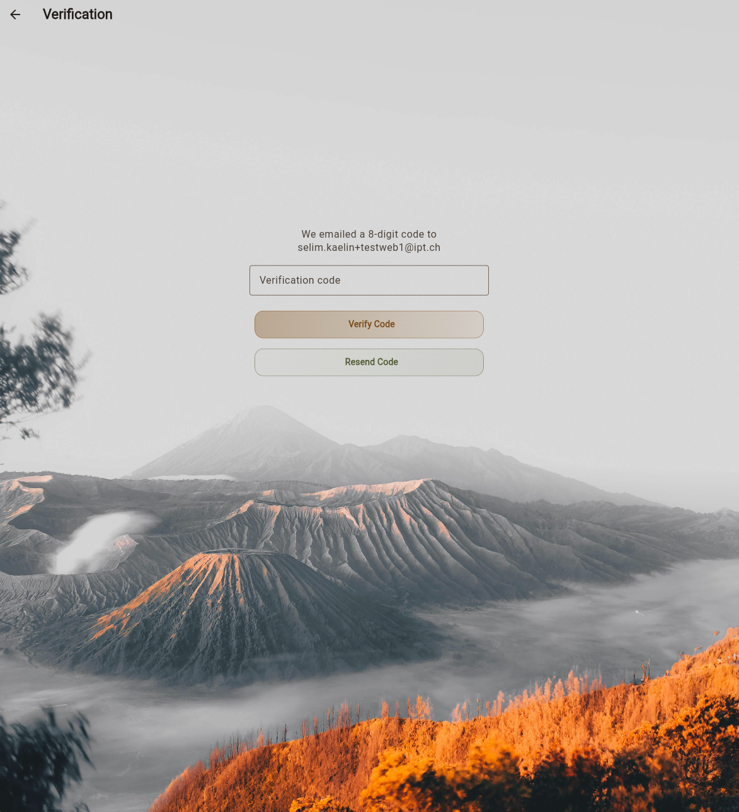
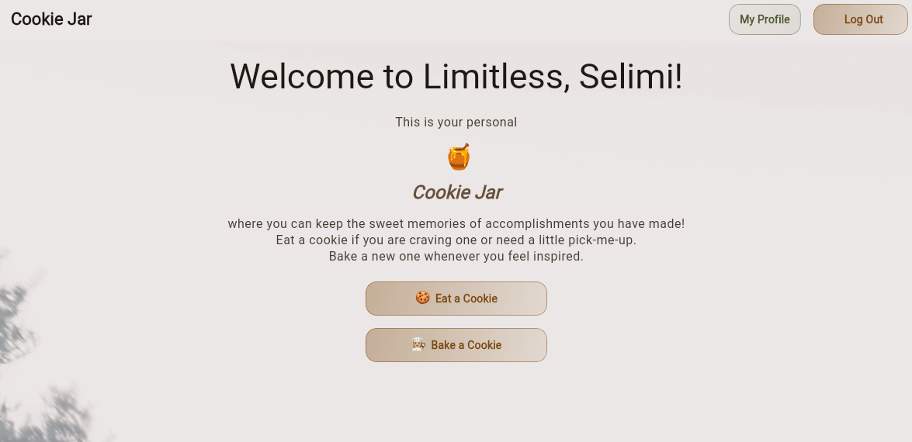
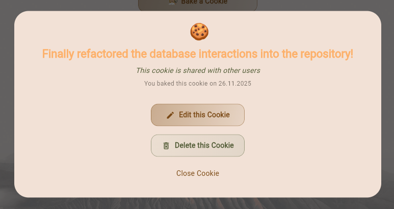
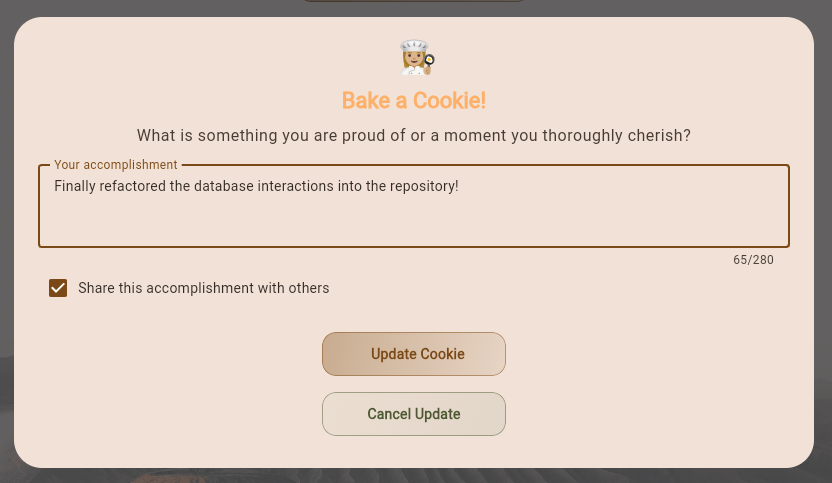
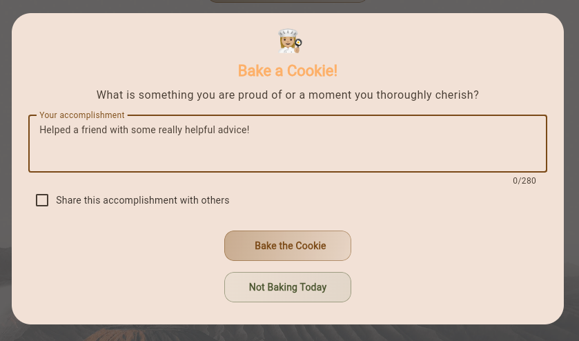
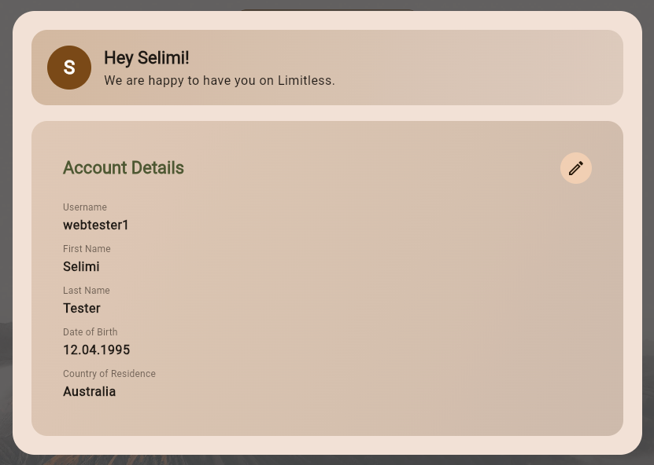

# Limitless

My little excuse to do some front-end, UX and UI development with Flutter.

## Idea

Limitless is intended as a collection of tools for people to exceed their own limits.
Eventually, it might contain multiple little apps that support productivity, goal-setting and achievement, or simply mental health.
For now, the collections is a first shot at making a beautiful hybrid app.

## Collection

### Cookie Jar

Inspired by David Goggin's concept of the cookie jar.
Bake cookies of your achievements and things you are proud of, so you can come back to them later, when you need a little boost.

#### Impressions

Start page in light mode:

Sign-up flow:

Dashboard:

Add and edit cookies:

User Profile:

